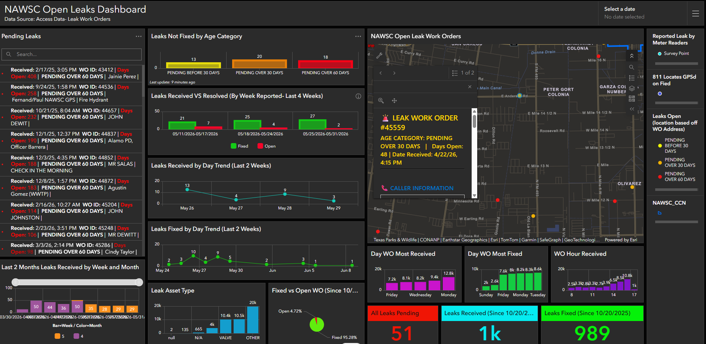

# Water-Leak-Operational-Analytics-and-Backlog-Monitoring-for-Water-Utilities
Developed an operational intelligence dashboard integrating Microsoft Access and GIS to monitor leak backlogs, response times, aging work orders, and field activity trends
## Executive Summary

Using Python, Microsoft Access, ArcGIS Online, and ArcGIS Dashboards, I developed an automated operational analytics solution to improve visibility into water leak response activities. Historical and active leak records stored within a Microsoft Access database were geolocated using customer addresses and transformed into a GIS feature layer enriched with operational metrics such as response time, leak status, and aging categories. The resulting dashboard provided utility leadership with near real-time insights into leak trends, backlog conditions, and response performance. Automated updates through Windows Task Scheduler ensured stakeholders had access to current information to support operational decision-making and resource planning

---

## Dashboard Highlights
The dashboard provided a centralized operational view of leak activity by integrating work order information from Microsoft Access with GIS. Leadership could monitor active leaks, backlog aging, response times, leak categories, and trends in incoming versus resolved work to support timely decision-making.
•	Total count of unresolved leaks.
•	Open leaks categorized by aging intervals (30, 60, and 90 days).
•	Color-coded leak locations displayed on an interactive map.
•	Daily trends comparing incoming versus fixed leaks.
•	Weekly trends identifying developing backlogs.
•	Leak distributions by asset type:

---

## Business Problem

Utility leadership lacked a centralized way to monitor active leak conditions, response performance, and emerging backlog trends. Although leak information existed within a Microsoft Access database, it was difficult to visualize geographically, identify aging work orders, or determine whether incoming leaks were being resolved quickly enough to prevent operational backlogs. A data-driven solution was needed to transform operational records into actionable insights that could support workload prioritization, improve situational awareness, and guide staffing and response decisions.

---

## Methodology

1.	Extracted water leak records from a Microsoft Access database using Python.
2.	Geolocated leak records using customer addresses while preserving all existing operational attributes from the source system.
3.	Enriched the dataset by calculating additional fields including:
o	Leak Status (Open vs. Fixed)
o	Response Time
o	Aging Categories (Within 30, 60, and 90 Days)
4.	Published the transformed data to an ArcGIS Online feature layer to support operational reporting.
5.	Developed an ArcGIS Dashboard to visualize active leaks, workload trends, and response metrics.
6.	Automated the extraction, transformation, and update process using Windows Task Scheduler to ensure information remained current without manual intervention.

---

## Skills

Python
•	ETL Development
•	Data Transformation
•	Database Integration
•	Geocoding Automation
•	Feature Layer Updates
•	Scheduled Automation
GIS
•	ArcGIS Online
•	Feature Services
•	Address Geocoding
•	Spatial Data Integration
•	Operational Mapping
Data Visualization
•	ArcGIS Dashboards
•	KPI Design
•	Interactive Filtering
•	Time-Series Visualization
•	Map-Based Decision Support
Analytical Techniques
•	Backlog Analysis
•	Trend Analysis
•	Response Time Analysis
•	Operational Performance Monitoring
•	Workload Prioritization

---

## Results & Business Recommendations

The dashboard transformed static leak records into an operational intelligence platform that provided utility stakeholders with visibility into active leak conditions and response performance. By automating data updates and integrating leak activity into GIS, decision-makers were able to identify emerging backlog trends and monitor whether leak resolutions were keeping pace with incoming work.
The analysis highlighted the total number of unresolved leaks and categorized them by aging intervals, allowing staff to quickly identify long-standing issues requiring attention. Daily and weekly trend indicators comparing incoming versus fixed leaks provided an early warning mechanism for developing backlogs. Additional visualizations identified leak distributions by asset type, including water mains, hydrants, valves, and angle stops, while response time trends provided insight into operational efficiency.
Based on these findings, the following recommendations were developed:
1.	Monitor daily and weekly incoming versus fixed leak trends to identify emerging backlogs before they become operational challenges.
2.	Prioritize unresolved leaks within older aging categories to reduce long-standing service issues.
3.	Allocate staffing and resources based on leak type trends and geographic concentrations of active leaks.
4.	Use response time indicators to evaluate operational performance and identify opportunities for process improvement.
5.	Continue leveraging automated dashboard updates to provide leadership with current information for decision-making and workload management.

